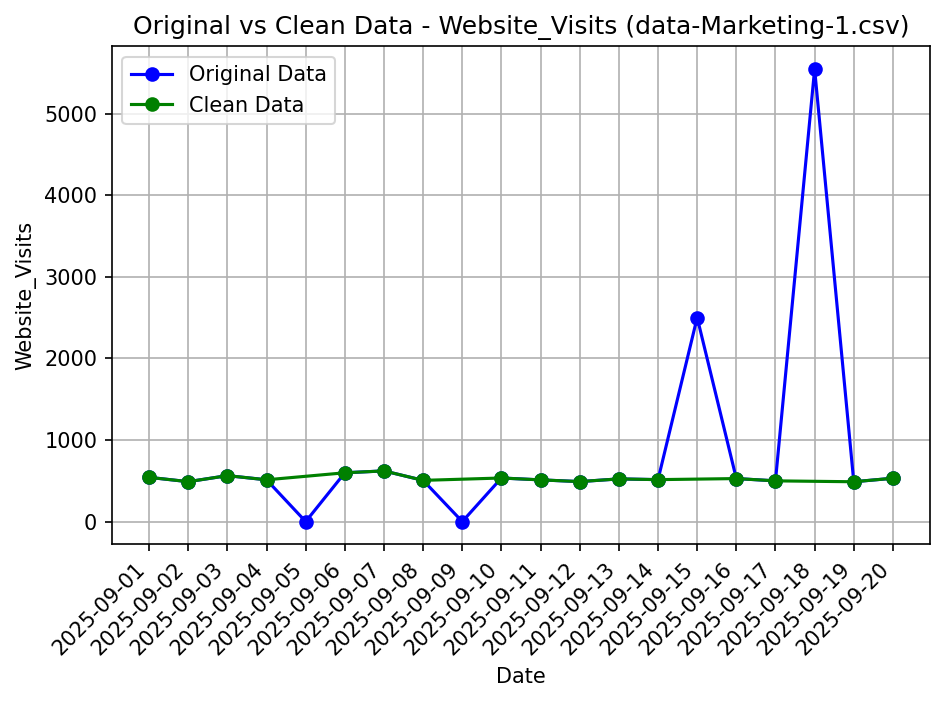

# Data Analysis Report
**Data Date:** 2025-09-01 to 2025-09-20
---
## Overview
This report presents a structured analysis of website visit data from September 1 to September 20, 2025. The analysis includes data cleaning to address outliers and missing values, computation of descriptive statistics, validation of methods, and a visual comparison of original and cleaned data. The intent is to provide a reliable summary and highlight any significant findings for the marketing dataset.

---
## 1. Data Cleaning
**Approach:**  
Zero sentinel removal and IQR fence. Zero readings are interpreted as missing values. Outliers are flagged if values exceed the upper IQR fence (Q1=505.0, Q3=563.0, IQR=58.0, lower fence=416.0, upper fence=652.0).

**Detected Outliers (removed):**
| Date        | Website_Visits | Reason                          |
|-------------|---------------|---------------------------------|
| 2025-09-05  | 0.0           | zero reading is a missing value |
| 2025-09-09  | 0.0           | zero reading is a missing value |
| 2025-09-15  | 2500.0        | above upper IQR fence           |
| 2025-09-18  | 5545.0        | above upper IQR fence           |

**Cleaned Data (n = 16):**
| Date        | Website_Visits |
|-------------|---------------|
| 2025-09-01  | 542.0         |
| 2025-09-02  | 489.0         |
| 2025-09-03  | 563.0         |
| 2025-09-04  | 512.0         |
| 2025-09-06  | 598.0         |
| 2025-09-07  | 621.0         |
| 2025-09-08  | 505.0         |
| 2025-09-10  | 534.0         |
| 2025-09-11  | 511.0         |
| 2025-09-12  | 490.0         |
| 2025-09-13  | 523.0         |
| 2025-09-14  | 514.0         |
| 2025-09-16  | 527.0         |
| 2025-09-17  | 499.0         |
| 2025-09-19  | 488.0         |
| 2025-09-20  | 531.0         |

**Result:**  
Four records were removed (two zero values and two high outliers above the upper IQR fence). Sixteen valid records remained for further analysis.

---
## 2. Descriptive Statistics
### Cleaned Data (After Outlier Removal)
**Summary:**
| Statistic           | Value    |
|---------------------|----------|
| Count               | 16       |
| Mean                | 527.9375 |
| Median              | 518.5    |
| Standard Deviation  | 38.0499  |
| Minimum             | 488.0    |
| Maximum             | 621.0    |

The cleaned dataset has a moderate spread (std dev ≈ 38), with values ranging between 488 and 621 website visits per day. The mean (527.94) and median (518.5) are close, indicating a nearly symmetric, non-skewed distribution after cleaning.

---
## 3. Validation Summary
- **Iteration 1:** Statistical calculations were checked, and descriptive statistics were corrected to match authoritative results. No further validation was necessary.
- **Iteration 2:** not required - approved on the first pass

---
## 4. Data Visualization

The above chart overlays the original and cleaned datasets. The original data (blue) shows significant spikes due to outliers and missing values, while the cleaned data (green) presents a smoother trend line, free from the anomalies. This illustrates the effectiveness of the cleaning process in normalizing the daily website visits.

---
## 5. Conclusions
The initial website visit data contained two zero readings (interpreted as missing) and two large outliers. After removal, the dataset showed consistent daily traffic levels, with no evidence of extreme volatility. Statistical measures portray a stable and representative sample of website visits, supporting reliable downstream analysis or reporting.

---
### Agent Workflow Summary
| Step | Agent             | Action                                            | Status/result        |
|------|-------------------|---------------------------------------------------|----------------------|
| 1    | DataCleaning      | Remove zeros and IQR outliers, output clean data  | Success              |
| 2    | DataStatistics    | Compute descriptive statistics on cleaned data    | Corrected & approved |
| 3    | AnalysisChecker   | Validate stats and methods                        | Approved             |
| 4    | PythonExecutorAgent| Generate comparison visualization                | Success              |
| 5    | ReportGenerator   | Assemble final structured report                  | Success              |

---
**Data Date:** 2025-09-01 to 2025-09-20
---
*End of Report*
