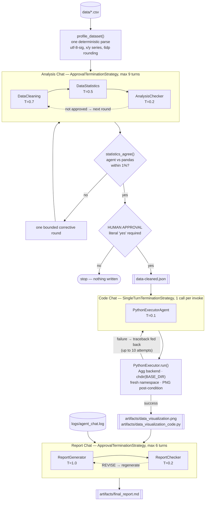
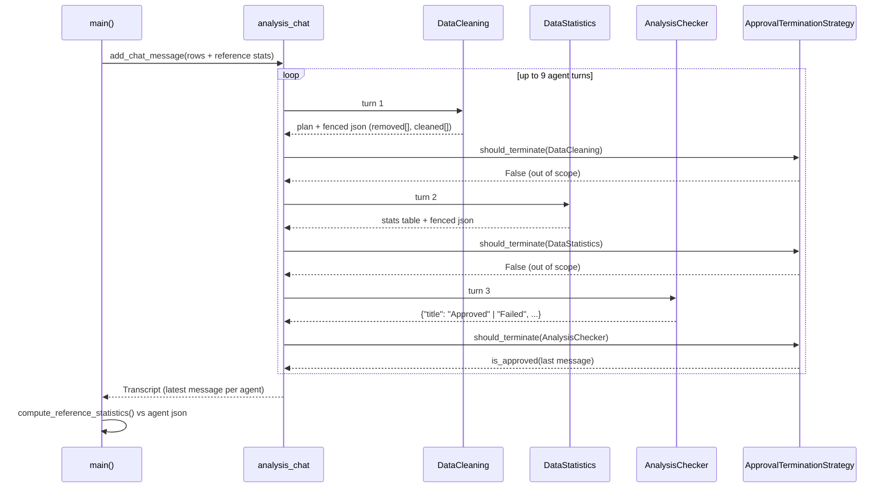

# Architecture

The pipeline is three `AgentGroupChat` phases separated by a human approval gate
and a local code-execution loop. Every agent turn is appended to
`logs/agent_chat.log`, which then becomes an input to the reporting phase — the
system reports on its own execution.

## End-to-end flow

## One analysis round, in detail

`AgentGroupChat.invoke()` loops `maximum_iterations` times over a round-robin
selection strategy, evaluating termination after **every** assistant message.
Scoping the strategy to the auditor is what stops the other two agents from
ending the chat.

## Agents

| Agent | T | Why that temperature | Chat | Output contract |
|---|---|---|---|---|
| `DataCleaning` | 0.7 | Choosing and justifying an outlier rule benefits from latitude | Analysis | `### CLEANING PLAN` prose, then a fenced json block with `removed[]` / `cleaned[]` |
| `DataStatistics` | 0.5 | Arithmetic with a little formatting tolerance | Analysis | Markdown table + fenced json (`count`, `mean`, `median`, `std`, `min`, `max`) |
| `AnalysisChecker` | 0.2 | An auditor must be reproducible | Analysis | One JSON object; `title` is `Approved` or `Failed` |
| `PythonExecutorAgent` | 0.1 | Code must be deterministic and runnable | Code | Raw Python, no fences |
| `ReportGenerator` | 1.0 | The one genuinely generative artifact | Report | Full markdown report per turn |
| `ReportChecker` | 0.2 | A reproducible gatekeeper | Report | `Approved - ...` or `REVISE` + numbered defects |

## Termination strategies

| Chat | Strategy | max turns | `automatic_reset` | Scoped to |
|---|---|---|---|---|
| `analysis_chat` | `ApprovalTerminationStrategy` | 9 (3 agents × 3 rounds) | yes | `AnalysisChecker` |
| `code_chat` | `SingleTurnTerminationStrategy` | 1 | yes | `PythonExecutorAgent` |
| `report_chat` | `ApprovalTerminationStrategy` | 6 (2 agents × 3 rounds) | yes | `ReportChecker` |

Three details in semantic-kernel 1.37 drive this table:

1. **`maximum_iterations` counts agent turns, not rounds.** Nine turns is three
   full clean → stats → check cycles.
2. **The default strategy never terminates and allows five iterations.** A
   single-agent `code_chat` left on defaults would spend five LLM calls per
   `invoke()` and return five competing scripts. `SingleTurnTerminationStrategy`
   caps it at one.
3. **`automatic_reset=True` is required to re-enter a completed chat.** Without
   it the second `invoke()` raises `AgentChatException("Chat is already
   complete")` — which is exactly what the code-retry loop does. It only flips
   `is_complete`; it does **not** clear history, so the agent can still see the
   code it needs to repair. (`chat.reset()` *would* clear it — never call it here.)

`TerminationStrategy.should_agent_terminate` is abstract and raises
`NotImplementedError`, so neither override delegates to `super()`. The starter
skeleton does, which would crash on the first non-approving turn.

## Where trust comes from

The published reference report for this project claims mean 533.19 / median
521.5 / std 37.21 for the cleaned marketing series. The correct values are
**527.94 / 518.5 / 38.05**. Nothing in a free-text agent hand-off can catch that,
so three mechanisms are layered in:

1. **Structured hand-off.** `DataCleaning` emits a fenced JSON block, so
   `data-cleaned.json` is a real dataset and the plot receives exact arrays
   instead of a prose table to re-parse.
2. **Deterministic cross-check.** `compute_reference_statistics()` recomputes
   with pandas. `statistics_agree()` compares within `numeric_tolerance`; a
   mismatch triggers exactly one corrective round (logged as
   `NUMERIC-DIVERGENCE`) and never an unbounded loop.
3. **Execution post-condition.** "The script did not raise" is not success. The
   executor deletes the expected PNG first, so the file's existence afterwards
   is proof the script actually plotted something.

## Files

| Path | Role |
|---|---|
| `final.py` | The entire pipeline — self-contained, no local imports |
| `config.json` | Optional overrides; deleting it changes nothing |
| `data/` `specs/` | Input datasets; agent instruction files |
| `logs/agent_chat.log` | Audit trail, and an input to the report phase |
| `artifacts/` | Generated plot, generated code, final report |
| `data-cleaned.json` | Structured cleaned dataset + both statistic sets + verdict |
| `verify_deliverables.py` | Post-run acceptance check |
| `tests/test_rubric.py` | Rubric conformance, asserted rather than claimed |
